# Example-of-using-EF-in-ASP.NET
Although the name of the project is about user registration, the project is not about that.

The project provides a simple example of using Entity Framework in Asp.Net

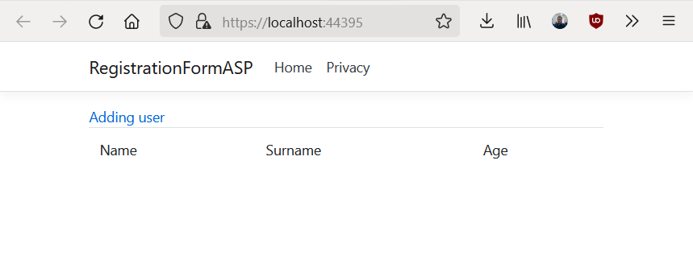

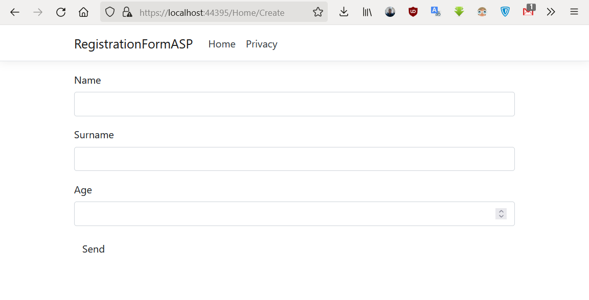

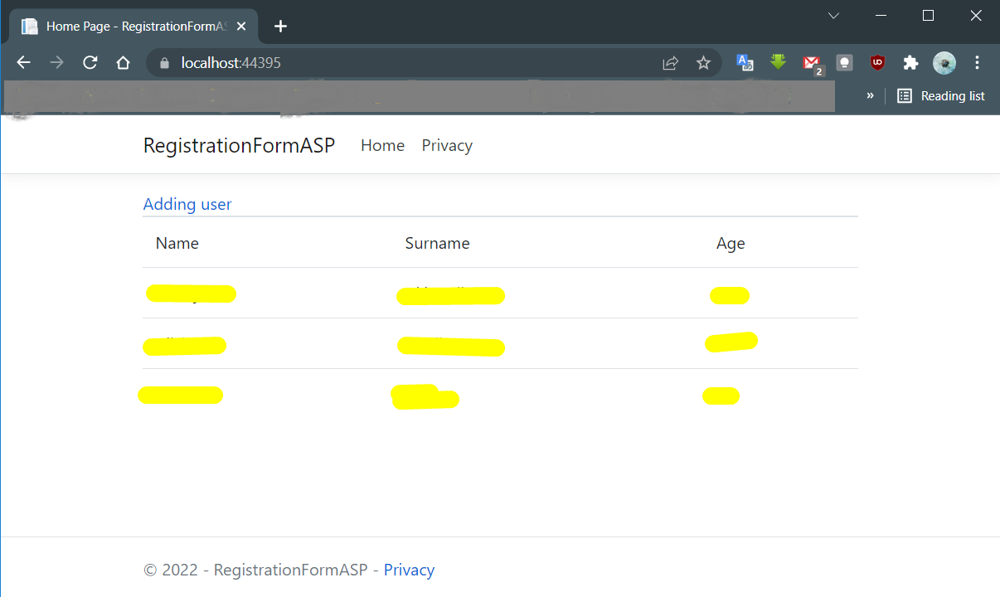

1. Create new class in model folder

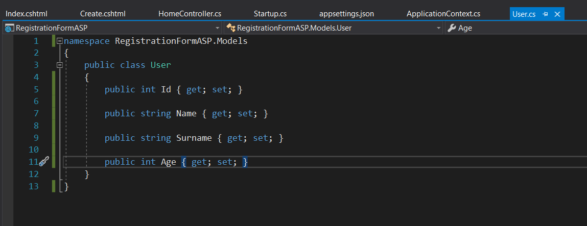

2. Adding SqlServer nuget package for project

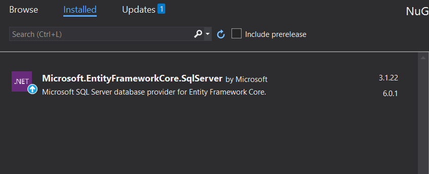

3. To interact with the database through the Entity Framework, we need a data context - a class inherited from the **Microsoft class.EntityFrameworkCore.DbContext**. Therefore, we will add a new class to the Models folder, which we will call ApplicationContext (the name of the context class is arbitrary):

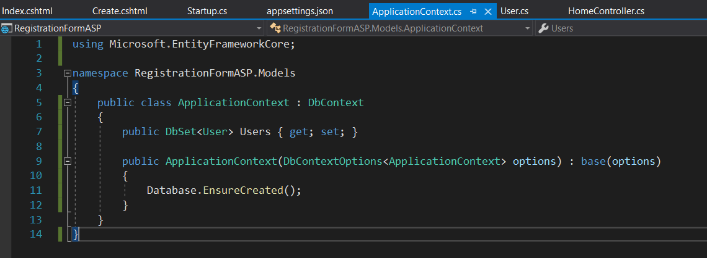

4. To connect to the database, we need to set the connection parameters. To do this, change the **appsettings.json** file by adding a connection string definition to it:

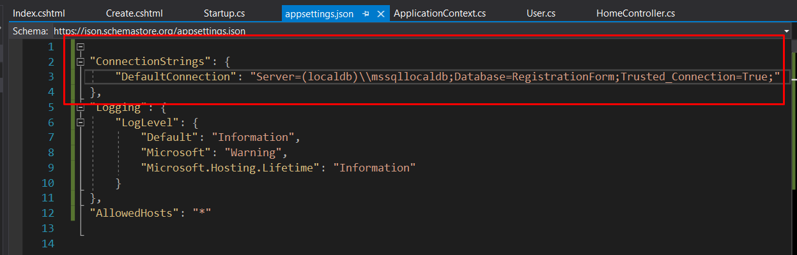

5. Adding a data context in the form of a service will then allow you to get it in the controller constructor through the dependency injection mechanism.

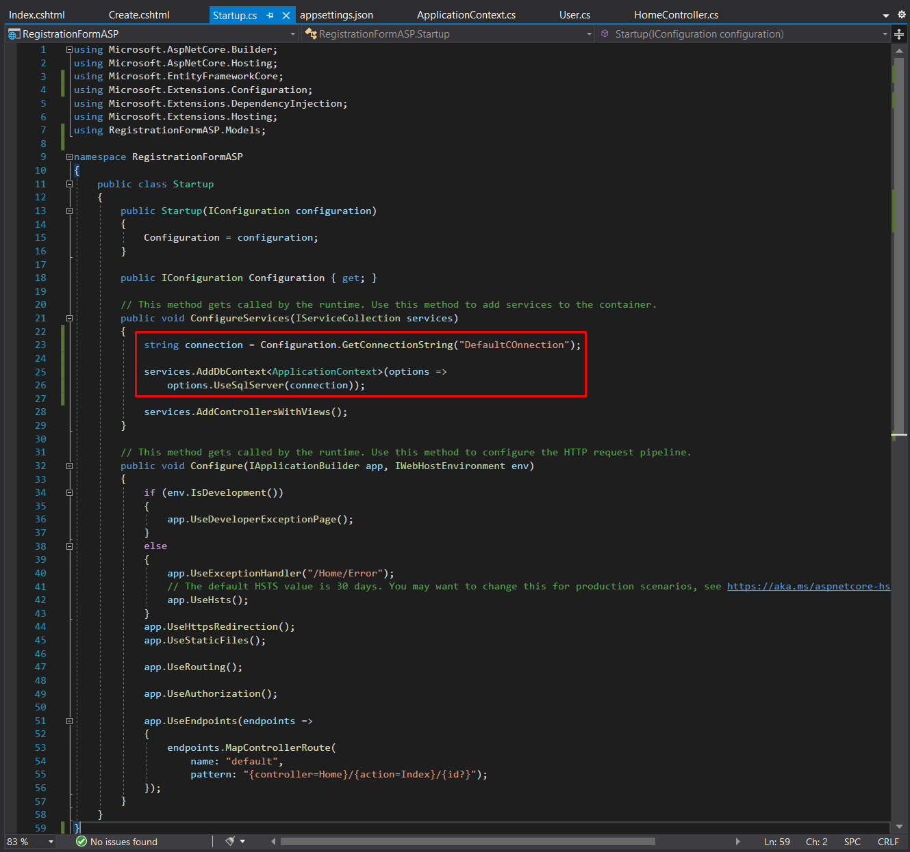

6. To interact with the database, the ApplicationContext db data context variable is defined in the controller.

Using the db method.Users.ToListAsnc() we will get objects from the database, create a list of them and pass them to the view.

And using the db method.Users.Add() an INSERT sql expression is formed for data from the user object, and the db.SaveChangesAsync() method executes this expression, thereby adding data to the database.

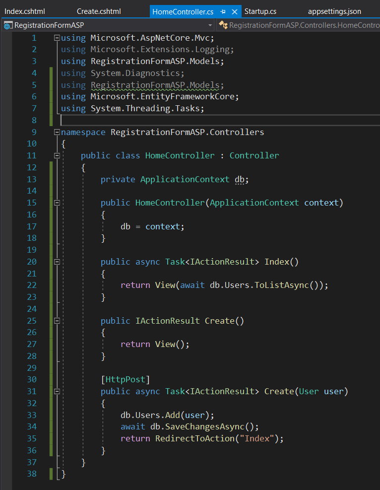

7. And add a new Create.cshtml view to the Views/Home folder:

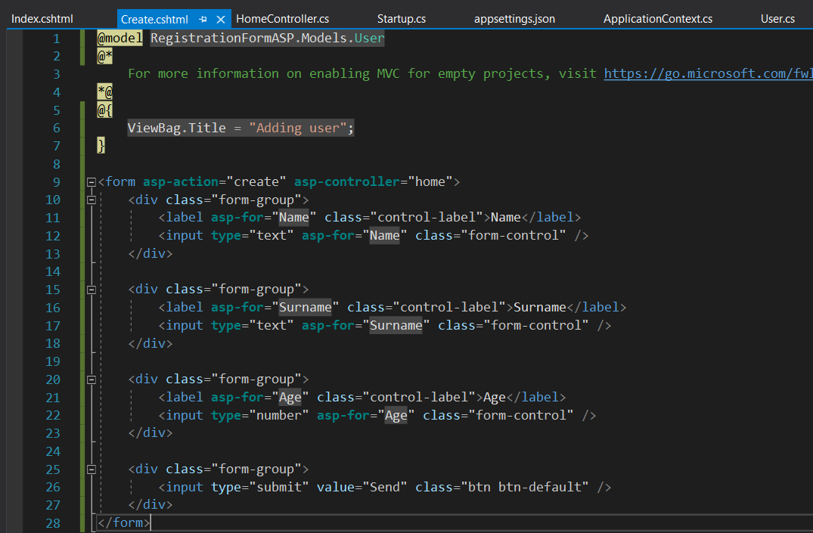

8. And we will also change (or add in the absence) the Index.cshtml representation, which will be responsible for the output of objects:

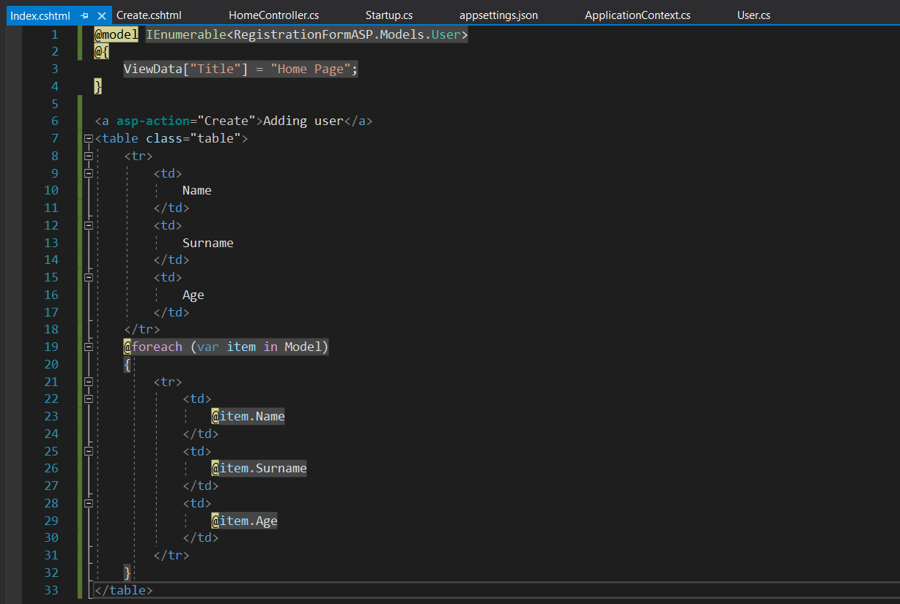
